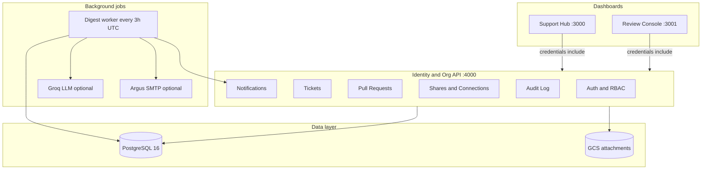
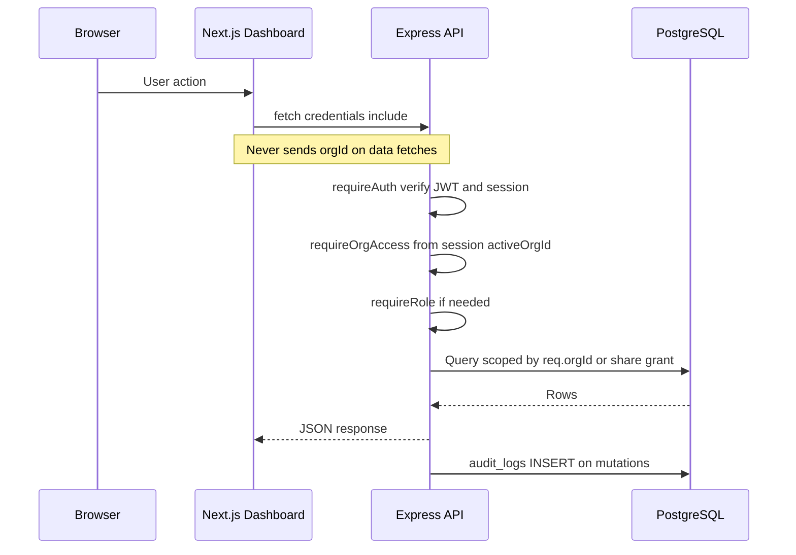
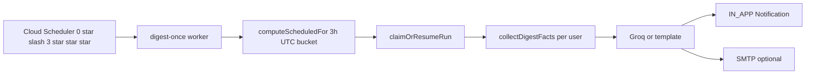

# Unified Org Workspace

> Multi-tenant dual-dashboard workspace with shared JWT identity, org isolation, cross-org item sharing, append-only audit, and AI progress digests — built for [Froncort.AI](https://froncort.ai).

[](https://github.com/prathameshk421/unified-org-workspace/actions/workflows/ci.yml)


**[Quick start](#quick-start)** · **[Architecture](#architecture)** · **[API](#api-overview)** · **[Configuration](#configuration)** · **[Testing](#testing)** · **[Deployment](#deployment)** · **[Docs](./docs/setup.md)**

---

## Table of contents

- [Overview](#overview)
- [Features](#features)
- [Architecture](#architecture)
- [Tech stack](#tech-stack)
- [Project structure](#project-structure)
- [Quick start](#quick-start)
- [Configuration](#configuration)
- [Usage](#usage)
- [API overview](#api-overview)
- [Development](#development)
- [Testing](#testing)
- [Deployment](#deployment)
- [Security](#security)
- [Performance](#performance)
- [Contributing](#contributing)
- [Troubleshooting](#troubleshooting)
- [Roadmap](#roadmap)
- [Acknowledgements](#acknowledgements)

---

## Overview

### What problem does this solve?

Organizations need **two product surfaces** — support ticketing and PR/audit review — that share one identity layer, enforce **strict tenant isolation**, and allow **controlled cross-org collaboration** without granting workspace-wide access.

### Why it exists

This repository is a full-stack reference implementation demonstrating:

- Cookie-based JWT sessions that sync across two Next.js dashboards
- Query-layer BOLA (Broken Object Level Authorization) enforcement
- Append-only audit logging at the **database permission** level
- Item-level cross-org shares (one ticket or PR at a time)
- Scheduled AI progress digests scoped per user

### Who it is for

| Audience | Use case |
| -------- | -------- |
| **Engineers evaluating the assignment** | Run locally, exercise auth/RBAC/BOLA, review architecture |
| **Platform / security reviewers** | Inspect tenant isolation, audit trail, share grants |
| **Operators** | Deploy to GCP via Terraform + GitHub Actions |

### High-level architecture



**Production** adds an nginx **gateway** on a single hostname (`/support-hub`, `/console`, `/api`) so session cookies work across dashboards. See [Deployment](#deployment).

Component diagrams (PNG):

| Diagram | Description |
| ------- | ----------- |
| [`docs/identity-org-service.png`](./docs/identity-org-service.png) | Express API — auth, RBAC, org scoping |
| [`docs/dashboard-1-support-hub.png`](./docs/dashboard-1-support-hub.png) | Support Hub — ticketing UI |
| [`docs/dashboard-2-review-console.png`](./docs/dashboard-2-review-console.png) | Review Console — PRs and audit |

---

## Features

### Identity and session

| Feature | Description |
| ------- | ----------- |
| **HttpOnly cookie auth** | `unified_access` (15m JWT) + `unified_refresh` (7d opaque) on the API origin — never `document.cookie` |
| **Cross-dashboard sync** | Log in on Hub → authenticated on Console (localhost three-port or production gateway) |
| **Org switcher** | Multi-org users switch active org via `POST /auth/switch-org` only |
| **Logout everywhere** | Revokes all sessions across both dashboards |
| **Rate-limited auth** | Login, register, refresh endpoints are rate-limited per email |

### Multi-tenancy and RBAC

| Feature | Description |
| ------- | ----------- |
| **Org-scoped queries** | `activeOrgId` comes **only** from verified session/JWT — never from client query/body |
| **Role matrix** | `ORG_ADMIN`, `SUPPORT_AGENT`, `REVIEWER`, `CROSS_ORG_GUEST`, plus platform admin |
| **BOLA gate** | Automated product-security test suite (`pnpm test:bola`) — non-negotiable in CI |
| **Guest lane** | `CROSS_ORG_GUEST` sees assignee tickets only; no org-wide lists |

### Support Hub (ticketing)

| Feature | Description |
| ------- | ----------- |
| **Ticket CRUD** | Create, update, status transitions, delete (role-gated) |
| **Comments** | Threaded comments with author edit rules |
| **Attachments** | Upload/download — 5 MB/file, 10/ticket, MIME allowlist; local FS or GCS |
| **Shared inbox** | View tickets shared from partner orgs (read + comment, no mutate) |

### Review Console (PRs and audit)

| Feature | Description |
| ------- | ----------- |
| **Manual PR workflow** | DRAFT → IN_REVIEW → APPROVED/REJECTED → MERGED (no GitHub sync) |
| **Versioned content** | PR edits bump version; approvals reset when content changes |
| **Multi-reviewer approval** | Configurable `requiresApprovals`; duplicate reviewer votes deduped |
| **PR comments and diffs** | Per-version diff view; cross-org comment `authorOrgId` |
| **Audit viewer** | Paginated org audit log + CSV export (`ORG_ADMIN`, `REVIEWER`) |

### Cross-org collaboration

| Feature | Description |
| ------- | ----------- |
| **Org connections** | Request / accept / reject / revoke partner org links |
| **Item-level shares** | Share one ticket or PR at a time via `ShareGrant` |
| **Inbound/outbound lists** | Track grants; revoke; re-share leaves prior `REVOKED` rows |
| **Platform force-revoke** | Platform admin can force-revoke connections |

### AI progress tracker (digests)

| Feature | Description |
| ------- | ----------- |
| **Personalized digests** | Per-user facts: assigned tickets, PRs waiting on review, shared items |
| **Scheduled delivery** | Background job every **3 hours UTC** (`DIGEST_INTERVAL_HOURS`); not on page load |
| **In-app bell** | `IN_APP` notifications; dashboards poll every 60s |
| **Optional email** | Argus-branded SMTP digest (`DIGEST_EMAIL_ENABLED`) |
| **LLM summaries** | Groq summarizes scoped facts once per user per run; template fallback |
| **Leak tests** | Dedicated BOLA test ensures digests never cross org boundaries |

### Operations

| Feature | Description |
| ------- | ----------- |
| **Append-only audit** | `unified_app` DB role: INSERT/SELECT only on `audit_logs` |
| **Dual DB URLs** | `DATABASE_URL` (migrate/seed) vs `DATABASE_APP_URL` (runtime) |
| **GCP deployment** | Terraform: Cloud Run × 4, Cloud SQL, Scheduler, Secret Manager |
| **CI/CD** | Lint, typecheck, build, unit/integration/BOLA, Newman, Playwright, Docker smoke |

---

## Architecture

### Request lifecycle (authenticated org route)



### Digest pipeline



### Design decisions

| Decision | Rationale |
| -------- | ----------- |
| **Cookies on API origin** | HttpOnly, CSRF-resistant; dashboards use `credentials: "include"` |
| **Org ID from session only** | Prevents BOLA via manipulated `orgId` query/body |
| **Item shares, not workspace shares** | Cross-org guests see one resource at a time |
| **Digest job off request path** | Predictable cost/latency; Groq called once per user per run |
| **Append-only audit at DB layer** | App guards alone are insufficient for compliance posture |
| **Gateway in production** | Single site enables third-party cookie sync in Chrome |

### Folder responsibilities

See [Project structure](#project-structure) below.

---

## Tech stack

| Layer | Technology | Why |
| ----- | ---------- | --- |
| **Language** | TypeScript 5.8 | End-to-end type safety across apps and packages |
| **Runtime** | Node.js 22+ | LTS alignment with Cloud Run base images |
| **Monorepo** | pnpm 10 + Turborepo 2 | Fast installs, cached builds across 9 packages |
| **API** | Express 4 | Identity/Org REST service with middleware pipeline |
| **Dashboards** | Next.js 15 (App Router) | Two independent React 19 frontends |
| **ORM** | Prisma 6 | Schema migrations, type-safe queries, seed |
| **Database** | PostgreSQL 16 | Relational tenancy, JSON settings, audit |
| **Auth** | JWT (jose) + opaque refresh | Short-lived access + rotatable refresh tokens |
| **Email** | Nodemailer + Gmail SMTP | Optional Argus digest delivery |
| **LLM** | Groq API | Digest summarization with template fallback |
| **Attachments** | Local FS / GCS | Dev filesystem; prod bucket via Terraform |
| **Gateway** | nginx (Alpine) | Path-based routing to Cloud Run upstreams |
| **IaC** | Terraform (GCP) | Cloud Run, Cloud SQL, Scheduler, WIF, secrets |
| **CI** | GitHub Actions | Quality gate + deploy via Workload Identity Federation |
| **Unit tests** | Vitest 3 | API and auth-client |
| **API smoke** | Newman (Postman) | Identity/RBAC/BOLA HTTP collection |
| **E2E** | Playwright 1.52 | Browser session-sync and guard tests |
| **Lint/format** | ESLint 9 + Prettier 3 | Shared config in `@unified/config` |

---

## Project structure

```
unified-org-workspace/
├── apps/
│   ├── api/                 # Express Identity/Org API (port 4000)
│   │   ├── src/routes/      # auth, tickets, prs, shares, audit, notifications, …
│   │   ├── src/digest/      # AI progress digest collection, summarize, dispatch
│   │   └── src/worker/      # digest-once.ts background entrypoint
│   ├── support-hub/         # Next.js Dashboard 1 — ticketing (port 3000)
│   ├── review-console/      # Next.js Dashboard 2 — PRs + audit (port 3001)
│   └── gateway/             # nginx reverse proxy (production)
├── packages/
│   ├── db/                  # Prisma schema, migrations, seed
│   ├── types/               # Shared DTOs, enums, RBAC constants
│   ├── auth-client/         # Credentialed fetch, AuthProvider, OrgSwitcher
│   ├── ui/                  # Shared React components (bell, dialog, toast, …)
│   └── config/              # Shared ESLint, TypeScript, Tailwind configs
├── infra/                   # Terraform — GCP Cloud Run, SQL, Scheduler, WIF
├── e2e/                     # Playwright browser tests
├── postman/                 # Newman auth/BOLA collection
├── docs/                    # Setup guide, limitations, architecture PNGs
├── scripts/                 # run-auth-e2e.sh, audit verification
├── docker-compose.yml       # Local PostgreSQL only
└── run_all.sh               # One-command local bootstrap
```

| Path | Responsibility |
| ---- | -------------- |
| `apps/api/src/lib/resource-access.ts` | Share-aware access helpers — isolation mirror for digests |
| `apps/api/src/middleware/audit-mutations.ts` | Flush audit rows after successful mutations |
| `packages/db/prisma/schema.prisma` | Single source of truth for all models |
| `packages/auth-client/src/react.tsx` | `BroadcastChannel` cross-tab auth sync |

---

## Quick start

### Prerequisites

- **Node.js 22+**
- **pnpm 10+** (`corepack enable`)
- **Docker Desktop** (PostgreSQL)

### One command

```bash
chmod +x run_all.sh   # first time only
./run_all.sh
```

Starts Postgres, migrates, seeds demo data, and runs all three apps.

| Service | URL |
| ------- | --- |
| API | http://localhost:4000/health |
| Support Hub | http://localhost:3000 |
| Review Console | http://localhost:3001 |

**Demo password:** `password123`

| User | Org(s) | Role |
| ---- | ------ | ---- |
| `alice@acme.com` | Acme | ORG_ADMIN |
| `bob@acme.com` | Acme | SUPPORT_AGENT |
| `carol@globex.com` | Globex | ORG_ADMIN |
| `dave@example.com` | Acme + Globex | REVIEWER (multi-org) |
| `eve@example.com` | Globex | SUPPORT_AGENT (receives Acme share) |
| `frank@example.com` | Acme | CROSS_ORG_GUEST (assignee-only) |
| `platform@example.com` | — | Platform admin |

### Manual setup

```bash
git clone https://github.com/prathameshk421/unified-org-workspace.git
cd unified-org-workspace
pnpm install
cp .env.example .env
docker compose up -d
pnpm --filter @unified/db db:migrate:deploy
pnpm --filter @unified/db db:seed
pnpm dev
```

### Verify

```bash
curl http://localhost:4000/health
# {"status":"ok"}
```

### Optional: run digest once

```bash
DIGEST_ENABLED=true pnpm --filter @unified/api digest:once
```

---

## Configuration

Copy `.env.example` → `.env`. Full reference:

<details>
<summary><strong>Environment variables (click to expand)</strong></summary>

### Database

| Variable | Required | Default | Description |
| -------- | -------- | ------- | ----------- |
| `DATABASE_URL` | Yes | — | Owner URL for `prisma migrate` and seed |
| `DATABASE_APP_URL` | Yes | — | Runtime API URL (`unified_app` role; audit INSERT-only) |

### API and dashboards

| Variable | Required | Default | Description |
| -------- | -------- | ------- | ----------- |
| `API_PORT` | No | `4000` | API listen port |
| `API_URL` | No | `http://localhost:4000` | Server-side API base |
| `NEXT_PUBLIC_API_URL` | Yes | — | Browser API base (baked into Next builds) |
| `NEXT_PUBLIC_SUPPORT_HUB_URL` | Yes | — | Hub URL for cross-links |
| `NEXT_PUBLIC_REVIEW_CONSOLE_URL` | Yes | — | Console URL for cross-links |
| `CORS_ORIGINS` | Yes | — | Comma-separated credentialed CORS origins |

### Auth

| Variable | Required | Default | Description |
| -------- | -------- | ------- | ----------- |
| `JWT_SECRET` | Yes | — | HS256 signing secret (≥ 32 chars) |
| `ACCESS_COOKIE_NAME` | No | `unified_access` | Access JWT cookie name |
| `REFRESH_COOKIE_NAME` | No | `unified_refresh` | Refresh token cookie name |
| `COOKIE_DOMAIN` | No | — | Parent domain for prod session sync (omit locally) |
| `COOKIE_SECURE` | No | auto | Force `Secure` cookies |
| `AUTH_RATE_LIMIT_MAX` | No | `10` | Auth requests/min per email (raise for e2e) |

### Digest worker

| Variable | Required | Default | Description |
| -------- | -------- | ------- | ----------- |
| `DIGEST_ENABLED` | No | `false` | Process users in digest job |
| `DIGEST_INTERVAL_HOURS` | No | `3` | UTC bucket size (8 runs/day) |
| `DIGEST_LLM_ENABLED` | No | auto | True when `GROQ_API_KEY` set |
| `GROQ_API_KEY` | No | — | Groq API key for LLM summaries |
| `GROQ_MODEL` | No | `openai/gpt-oss-20b` | Groq model id |
| `DIGEST_TICKET_STALE_DAYS` | No | `3` | Stale assigned ticket threshold |
| `DIGEST_PR_IDLE_DAYS` | No | `3` | Idle PR threshold |
| `DIGEST_EMAIL_ENABLED` | No | `false` | Send Argus email digests |
| `SMTP_HOST` / `SMTP_PORT` / `SMTP_USER` / `SMTP_PASS` | If email | Gmail defaults | SMTP credentials |
| `DIGEST_EMAIL_ALLOWLIST` | No | — | Comma-separated rollout allowlist |
| `DIGEST_EMAIL_REDIRECT_TO` | No | — | **Local/test only** — redirect all mail |

### Attachments

| Variable | Required | Default | Description |
| -------- | -------- | ------- | ----------- |
| `ATTACHMENTS_DIR` | No | `./data/attachments` | Local storage path |
| `ATTACHMENTS_BACKEND` | No | `fs` | `fs` or `gcs` |
| `ATTACHMENTS_GCS_BUCKET` | If GCS | — | Set by Terraform in production |

</details>

> **Secrets in production** live in GCP Secret Manager (`JWT_SECRET`, `DATABASE_URL`, `DATABASE_APP_URL`, `GROQ_API_KEY`, `SMTP_*`). See `infra/secrets.tf`.

---

## Usage

### Common workflows

**1. Log in on Hub, open Console — already authenticated**

Both dashboards call `GET /auth/me` with `credentials: "include"`. Session cookies live on the API origin.

**2. Dave switches org (Acme ↔ Globex)**

Use the org switcher in the header — sends only `POST /auth/switch-org`. All data fetches stay org-agnostic.

**3. Alice shares a ticket with Eve (cross-org)**

1. Acme admin accepts org connection with Globex
2. Alice creates share on a ticket → grantee org Globex, user Eve
3. Eve sees it under **Shared with me** — can view and comment, not mutate

**4. Run AI digest locally**

```bash
DIGEST_ENABLED=true DIGEST_INTERVAL_HOURS=3 pnpm --filter @unified/api digest:once
```

Check the notification bell after the run (polls every 60s).

### API examples

**Login**

```bash
curl -c cookies.txt -X POST http://localhost:4000/auth/login \
  -H "Content-Type: application/json" \
  -d '{"email":"alice@acme.com","password":"password123"}'
```

**Current user**

```bash
curl -b cookies.txt http://localhost:4000/auth/me
```

**List tickets (org from session)**

```bash
curl -b cookies.txt http://localhost:4000/tickets
```

**BOLA probe — Alice cannot switch to Globex**

```bash
curl -b cookies.txt -X POST http://localhost:4000/auth/switch-org \
  -H "Content-Type: application/json" \
  -d '{"orgId":"<globex-org-id>"}'
# → 403 Forbidden
```

---

## API overview

Base URL: `http://localhost:4000` (local) or `${GATEWAY_ORIGIN}/api` (production).

**Authentication:** HttpOnly cookies set by `/auth/login`. Send `credentials: "include"` from browsers. No Bearer token flow in dashboards.

**Org scoping:** Protected org routes derive `orgId` from session — never accept client-supplied org on data endpoints.

<details>
<summary><strong>Route reference (click to expand)</strong></summary>

### Public

| Method | Path | Description |
| ------ | ---- | ----------- |
| GET | `/health` | Liveness |

### Auth (`/auth`)

| Method | Path | Description |
| ------ | ---- | ----------- |
| POST | `/auth/register` | Register user + session |
| POST | `/auth/login` | Authenticate |
| POST | `/auth/refresh` | Rotate access token |
| POST | `/auth/logout` | Revoke current session |
| POST | `/auth/logout-everywhere` | Revoke all sessions |
| GET | `/auth/me` | User, memberships, active org |
| POST | `/auth/switch-org` | Switch active org (membership validated) |

### Tickets (`/tickets`)

| Method | Path | Description |
| ------ | ---- | ----------- |
| GET | `/tickets` | List org tickets |
| POST | `/tickets` | Create |
| GET/PATCH/DELETE | `/tickets/:id` | Read/update/delete |
| PATCH | `/tickets/:id/status` | Status transition |
| GET/POST | `/tickets/:id/comments` | Comments |
| GET/POST | `/tickets/:id/attachments` | Attachments |
| GET | `/tickets/:id/attachments/:aid/download` | Download file |

### Pull requests (`/prs`)

| Method | Path | Description |
| ------ | ---- | ----------- |
| GET/POST | `/prs` | List/create |
| GET/PATCH | `/prs/:id` | Read/update |
| POST | `/prs/:id/transition` | Workflow transition |
| POST | `/prs/:id/reviews` | Submit review |
| GET | `/prs/:id/versions` | Version history |
| GET | `/prs/:id/versions/:n/diff` | Version diff |
| GET/POST | `/prs/:id/comments` | PR comments |

### Sharing and connections

| Method | Path | Description |
| ------ | ---- | ----------- |
| GET/POST | `/connections` | Org connections |
| POST | `/connections/:id/accept\|reject\|revoke` | Connection lifecycle |
| POST/GET | `/tickets/:id/shares`, `/prs/:id/shares` | Item shares |
| GET | `/shares/inbound`, `/shares/outbound` | Share lists |
| DELETE | `/shares/:id` | Revoke share |
| GET | `/shared/tickets`, `/shared/prs` | Inbound shared items |

### Audit, settings, notifications

| Method | Path | Description |
| ------ | ---- | ----------- |
| GET | `/audit` | Paginated audit log |
| GET | `/audit/export` | CSV export |
| GET/PATCH | `/org/settings` | Org settings |
| GET | `/notifications` | User notifications (bell) |
| GET | `/notifications/unread-count` | Unread badge count |
| POST | `/notifications/:id/read` | Mark read |

### Error responses

| Status | Meaning |
| ------ | ------- |
| `401` | Unauthenticated or session revoked |
| `403` | Insufficient role or invalid org switch |
| `404` | Resource not found **or** BOLA denial (no existence leak) |
| `415` | Non-JSON body on auth routes |
| `429` | Auth rate limit exceeded |

</details>

Interactive collection: `postman/unified-org-identity-auth.postman_collection.json`

---

## Development

### Local workflow

```bash
pnpm dev          # Turbo: API + both dashboards (watch mode)
pnpm build        # Production builds all packages
pnpm lint         # ESLint across monorepo
pnpm typecheck    # tsc --noEmit
pnpm format       # Prettier write
pnpm format:check # Prettier check
```

### Package-level commands

```bash
pnpm --filter @unified/api dev
pnpm --filter @unified/support-hub dev
pnpm --filter @unified/review-console dev
pnpm --filter @unified/db db:studio   # Prisma Studio (interactive)
```

### Pre-commit hooks

> No Husky or pre-commit hooks are configured in this repository. CI enforces lint, typecheck, build, and tests on push/PR to `main`.

### CI/CD pipelines

| Workflow | Trigger | Jobs |
| -------- | ------- | ---- |
| [`ci.yml`](./.github/workflows/ci.yml) | PR/push to `main` | quality → auth-e2e, api-integration, docker-smoke |
| [`deploy.yml`](./.github/workflows/deploy.yml) | CI success on `main` or manual | Build/push images, migrate, roll out Cloud Run |
| [`seed-demo.yml`](./.github/workflows/seed-demo.yml) | Manual | Execute seed job in production |

---

## Testing

### Test pyramid

| Layer | Command | Requires |
| ----- | ------- | -------- |
| **Unit** | `pnpm test` | Nothing |
| **Integration** | `pnpm test:integration` | Migrated Postgres |
| **BOLA / product security** | `pnpm test:bola` | Migrated Postgres |
| **Auth smoke (Newman)** | `pnpm test:auth` | API on `:4000` |
| **Audit DB permissions** | `pnpm --filter @unified/db test:audit-append-only` | Migrated Postgres |
| **E2E (Playwright)** | `bash scripts/run-auth-e2e.sh` | Migrate + seed; starts all services |

### What BOLA covers

The `vitest.bola.config.ts` allowlist includes auth, tickets, PRs, shares, connections, audit, AI digest leak, and `product-bola/**` nested-route matrices. **Do not ship without `pnpm test:bola` passing.**

### E2E suites (`e2e/`)

| Spec | Coverage |
| ---- | -------- |
| `session-sync.spec.ts` | Hub ↔ Console login/logout sync |
| `cross-tab-sync.spec.ts` | Logout and org-switch across tabs |
| `auth-guards.spec.ts` | `returnTo` redirects, open-redirect rejection |
| `token-revocation.spec.ts` | Logout-everywhere invalidates other contexts |
| `bola-ui.spec.ts` | No `orgId` on fetches except `switch-org` |

> Test coverage percentages are not collected in CI. Vitest runs unit and integration suites; Playwright covers browser flows.

---

## Deployment

### Local

Docker Compose runs **PostgreSQL only**. Apps run on the host via `pnpm dev` or production builds.

### Production (GCP)

Terraform in [`infra/`](./infra/) provisions:

| Resource | Name pattern | Notes |
| -------- | ------------ | ----- |
| Cloud Run service | `unified-org-api` | VPC + Cloud SQL socket |
| Cloud Run service | `unified-org-support-hub` | Next.js standalone |
| Cloud Run service | `unified-org-review-console` | Next.js standalone |
| Cloud Run service | `unified-org-gateway` | nginx path router |
| Cloud Run job | `unified-org-migrate` | `prisma migrate deploy` |
| Cloud Run job | `unified-org-seed` | Demo seed (manual) |
| Cloud Run job | `unified-org-digest` | Digest worker every 3h UTC |
| Cloud Scheduler | `unified-org-digest-daily` | Cron `0 */3 * * *` |
| Cloud SQL | PostgreSQL 16 | Private IP, no public IPv4 |
| GCS bucket | `unified-org-attachments-*` | Ticket attachments |

### Gateway paths (production)

| Path | Upstream |
| ---- | -------- |
| `/` | Landing page |
| `/support-hub` | Support Hub |
| `/console` | Review Console |
| `/api/` | Identity/Org API |

### Deploy flow

1. Merge to `main` → CI passes
2. `deploy.yml` builds and pushes images to Artifact Registry (tagged by commit SHA + `latest`)
3. Migrate job executes
4. Cloud Run services roll out (API, Hub, Console, Gateway)
5. Smoke tests hit `/api/health` and dashboard routes

### Rollback

> **Not automated.** Roll back by re-deploying a previous image tag from Artifact Registry (`api:<sha>`, etc.) via `gcloud run services update` or re-running the deploy workflow against an earlier commit. Database migrations are forward-only — plan rollback accordingly.

Bootstrap: copy `infra/terraform.tfvars.example` → `terraform.tfvars` and `terraform apply`.

---

## Security

| Area | Implementation |
| ---- | -------------- |
| **Authentication** | HttpOnly cookies; JWT verified on every `requireAuth` call; session revocation checked live |
| **Authorization** | RBAC middleware (`requireRole`); platform admin separate path |
| **Tenant isolation** | Query-layer `orgId` from session; BOLA returns 404/403; automated test gate |
| **Cross-org** | Item-level `ShareGrant` only; guests read + comment; no workspace access |
| **Audit** | Append-only at DB permissions (`unified_app` cannot UPDATE/DELETE `audit_logs`) |
| **CSRF** | `requireJsonContentType` on auth mutations; SameSite cookie matrix in code |
| **Rate limiting** | Auth endpoints per-email sliding window |
| **Helmet** | Security headers on API (CORP not relaxed) |
| **Secrets** | Secret Manager in prod; `.env` locally (never commit) |
| **Validation** | Zod schemas on request bodies and query params |

See [`AGENTS.md`](./AGENTS.md) for non-negotiable agent/human rules around BOLA and session sync.

---

## Performance

| Topic | Current state |
| ----- | ------------- |
| **Caching** | `Cache-Control: no-store` on `/auth/me` and notifications — no HTTP caching of auth state |
| **Digest concurrency** | Sequential per-user processing in digest job; `DIGEST_MAX_USERS_PER_RUN` cap |
| **DB connections** | Prisma connection pool per Cloud Run instance |
| **Attachments** | Streaming upload/download; GCS in production |
| **Bell polling** | 60s interval + visibility-change refresh (not SSE/WebSocket) |
| **Scalability** | Cloud Run autoscaling 0–10 per service; digest job single-runner with bucket dedupe |
| **Known bottlenecks** | Groq rate limits on large user counts; Gmail SMTP daily send caps for email digests |

---

## Contributing

> This is a private assignment repository. The guidelines below match how CI expects changes.

### Branch naming

```
feat/short-description
fix/short-description
chore/short-description
```

### Commit messages

Use imperative mood, focused on **why**:

```
Add 3-hour digest interval bucketing

Replace UTC-day scheduledFor with configurable N-hour buckets
so Cloud Scheduler runs every 3h actually create new digests.
```

### Pull request checklist

- [ ] `pnpm lint && pnpm typecheck && pnpm build && pnpm test` pass locally
- [ ] `pnpm test:bola` passes (if touching API queries or auth)
- [ ] BOLA: no `orgId` from client on data fetches; share queries use grant checks
- [ ] Audit mutations recorded for new write endpoints
- [ ] `.env.example` updated if new env vars added
- [ ] No secrets committed

---

## Troubleshooting

| Issue | Cause | Fix |
| ----- | ----- | --- |
| `Port 4000/3000/3001 already in use` | Stale dev server | `lsof -iTCP:4000 -sTCP:LISTEN` then kill PID |
| `401` on API calls | Expired session or changed `JWT_SECRET` | Re-login; keep `JWT_SECRET` stable |
| Session not syncing between dashboards | Production: separate `*.run.app` hosts | Use gateway single hostname or `COOKIE_DOMAIN` |
| Migration errors | Postgres not running | `docker compose up -d` then `db:migrate:deploy` |
| `pnpm test:auth` fails | API not on `:4000` | Start API: `pnpm --filter @unified/api dev` |
| E2E timeouts | Hung Next.js dev server | Kill ports 3000/3001/4000; run `bash scripts/run-auth-e2e.sh` |
| Digest produces nothing | `DIGEST_ENABLED=false` or empty facts | Set `DIGEST_ENABLED=true`; ensure user has assigned work |
| Duplicate digest skipped | Same UTC bucket already succeeded | Expected — one run per `scheduledFor` bucket |
| Playwright `429` mid-run | Auth rate limit | Set `AUTH_RATE_LIMIT_MAX=1000` in `.env` |

More: [`docs/setup.md`](./docs/setup.md#troubleshooting)

---

## Roadmap

Derived from [`docs/known-limitations.md`](./docs/known-limitations.md) — planned improvements, not implemented:

| Area | Planned |
| ---- | ------- |
| **Realtime notifications** | SSE/push alongside interval digests |
| **Event-driven agents** | Triggers on assign, idle PR, overdue ticket |
| **GitHub integration** | Webhook sync for real PRs |
| **AI copilot** | In-app chatbot scoped to org + shares |
| **Org admin UI** | Invites, role management, self-service signup |
| **Auto-triage** | Classify tickets, suggest assignee/priority |

Current intentional gaps: login-only UI (no signup page), manual PRs, batched digests (not instant assign alerts), no org member management UI.

---

## Acknowledgements

Built with:

- [Next.js](https://nextjs.org/) · [Express](https://expressjs.com/) · [Prisma](https://www.prisma.io/) · [PostgreSQL](https://www.postgresql.org/)
- [Turborepo](https://turbo.build/) · [pnpm](https://pnpm.io/)
- [Playwright](https://playwright.dev/) · [Vitest](https://vitest.dev/) · [Newman](https://www.npmjs.com/package/newman)
- [Groq](https://groq.com/) (optional digest LLM) · [Google Cloud Run](https://cloud.google.com/run) (production)

Further reading:

- [`docs/setup.md`](./docs/setup.md) — detailed local setup
- [`docs/known-limitations.md`](./docs/known-limitations.md) — product gaps and future work
- [`AGENTS.md`](./AGENTS.md) — rules for AI agents working in this repo
