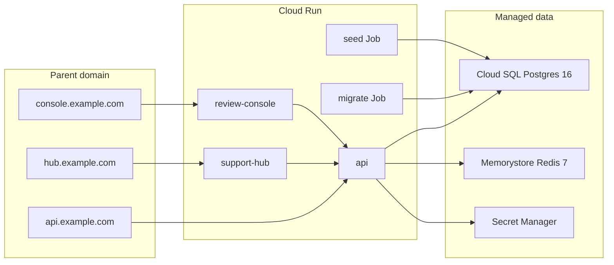

# GCP Deployment Guide

Production deployment for **unified-org-workspace** on Google Cloud Platform using Cloud Run, Cloud SQL PostgreSQL 16, Memorystore Redis 7, and GitHub Actions with Workload Identity Federation.

## Architecture



| Component | GCP service | Notes |
|---|---|---|
| API | Cloud Run (`unified-org-api`) | Express, listens on `$PORT` |
| Support Hub | Cloud Run (`unified-org-support-hub`) | Next.js standalone |
| Review Console | Cloud Run (`unified-org-review-console`) | Next.js standalone |
| Migrations | Cloud Run Job (`unified-org-migrate`) | `prisma migrate deploy` |
| Demo seed | Cloud Run Job (`unified-org-seed`) | One-shot via `seed-demo` workflow |
| Database | Cloud SQL PostgreSQL 16 | Private IP + Cloud SQL connector |
| Cache | Memorystore Redis 7 | VPC-private |
| Images | Artifact Registry (`unified-org`) | Built by GitHub Actions |
| Secrets | Secret Manager | JWT, DB URLs, Redis URL |
| Deploy auth | Workload Identity Federation | No JSON service-account keys |

## URLs

### Default (recommended for assignment): Cloud Run `*.run.app`

No custom domain required. After `terraform apply`, use:

```bash
terraform output cloud_run_urls
```

Example:

| Service | URL |
|---|---|
| API | `https://unified-org-api-xxxxx-uc.a.run.app` |
| Support Hub | `https://unified-org-support-hub-xxxxx-uc.a.run.app` |
| Review Console | `https://unified-org-review-console-xxxxx-uc.a.run.app` |

Submit these public URLs + demo credentials for the assignment deliverable.

### Optional: custom domain

Set `enable_custom_domain = true` in `terraform.tfvars` and configure DNS for `api.` / `hub.` / `console.` subdomains. Only needed if you want shared cookies across dashboards (Tier 1 session sync).

## Environment and secrets

### Secret Manager (populated by Terraform)

| Secret | Used by | Description |
|---|---|---|
| `JWT_SECRET` | API | Session/JWT signing |
| `DATABASE_URL` | Migrate/seed jobs | Postgres owner (`postgres`) via Cloud SQL socket |
| `DATABASE_APP_URL` | API runtime | Restricted `unified_app` role (append-only audit) |
| `REDIS_URL` | API | Memorystore connection string |

### Cloud Run API env (set by Terraform)

| Variable | Example |
|---|---|
| `COOKIE_DOMAIN` | `.example.com` |
| `API_URL` | `https://api.example.com` |
| `SESSION_COOKIE_NAME` | `unified_session` |

### Next.js build-time vars (set in CD)

| Variable | Service |
|---|---|
| `NEXT_PUBLIC_API_URL` | support-hub, review-console |
| `NEXT_PUBLIC_SUPPORT_HUB_URL` | support-hub |
| `NEXT_PUBLIC_REVIEW_CONSOLE_URL` | review-console |

## Demo credentials

Run the **Seed Demo Data** workflow once after the first successful deploy and migration.

| Email | Org | Role | Password |
|---|---|---|---|
| `alice@acme.com` | Acme | ORG_ADMIN | `password123` |
| `bob@acme.com` | Acme | SUPPORT_AGENT | `password123` |
| `carol@globex.com` | Globex | ORG_ADMIN | `password123` |
| `dave@example.com` | Acme + Globex | REVIEWER | `password123` |

Organizations: **Acme Corp** (`acme`) and **Globex Inc** (`globex`) with an accepted cross-org connection.

## One-time bootstrap (no custom domain)

### 1. GCP auth

```bash
gcloud auth application-default login
gcloud config set project unified-org-workspace
gcloud config set compute/region us-central1
```

### 2. Apply Terraform (~15–20 min)

```bash
cd infra
cp terraform.tfvars.example terraform.tfvars
terraform init
terraform plan
terraform apply
```

`enable_custom_domain = false` by default — skips DNS and domain mappings.

Save outputs:

```bash
terraform output wif_provider
terraform output github_deploy_service_account
terraform output cloud_run_urls
```

### 3. GitHub repository variables

Settings → Secrets and variables → Actions → **Variables**:

| Variable | Value |
|---|---|
| `GCP_PROJECT_ID` | `unified-org-workspace` |
| `GCP_REGION` | `us-central1` |
| `WIF_PROVIDER` | `terraform output wif_provider` |
| `WIF_SERVICE_ACCOUNT` | `terraform output github_deploy_service_account` |
| `API_URL` | from `terraform output cloud_run_urls` → `api` |
| `SUPPORT_HUB_URL` | from `terraform output cloud_run_urls` → `support_hub` |
| `REVIEW_CONSOLE_URL` | from `terraform output cloud_run_urls` → `review_console` |

### 4. Push deployment code to GitHub

```bash
git add .
git commit -m "Add GCP deployment infrastructure and CI/CD"
git push origin main
```

### 5. First deploy

CI runs on push; **Deploy** runs after CI succeeds. Or trigger **Deploy** manually in GitHub Actions.

### 6. Seed demo data (once)

GitHub Actions → **Seed Demo Data** → Run workflow.

### 7. Verify

```bash
curl "$(terraform output -raw api_url)/health"
```

Open Support Hub and Review Console URLs in a browser.

---

## One-time bootstrap (custom domain — optional)

Skip DNS entirely if using `*.run.app` URLs above.

### DNS records (only when `enable_custom_domain = true`)

Create records from `terraform output domain_mapping_records` for `api.`, `hub.`, and `console.` subdomains.

## Routine releases

Push to `main` → CI passes → Deploy workflow runs automatically.

To redeploy manually without a code change, trigger **Deploy** via `workflow_dispatch`.

## Runbook

### Check service health

```bash
curl https://api.<domain>/health
```

### View Cloud Run logs

```bash
gcloud run services logs read unified-org-api --region=<region> --limit=50
```

### Re-run migrations

```bash
gcloud run jobs execute unified-org-migrate --region=<region> --wait
```

### Re-seed demo data

Trigger the **Seed Demo Data** workflow in GitHub Actions.

### Rotate secrets

Update values in Secret Manager, then redeploy affected Cloud Run services/jobs so new revisions pick up `latest` secret versions.

### Terraform changes

```bash
cd infra
terraform plan
terraform apply
```

Cloud Run container images are managed by CD (`lifecycle.ignore_changes` on image) — Terraform will not revert deployed images.

## Known limits (first cut)

- No auto-seed on deploy
- No background worker / digest job (Tier 2)
- Single-region, cost-optimized sizing (`db-f1-micro`, Redis BASIC 1 GB)
- Redis is provisioned but not yet used by application code

## Related docs

- [Local setup](./setup.md)
- [Assignment spec](./requirements/assignment-spec.md)
- [Database schema](./requirements/database-schema.md)
