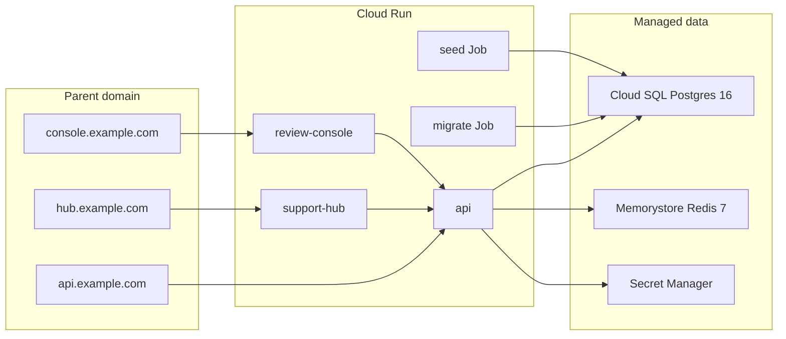

# GCP Deployment Guide

Production deployment for **unified-org-workspace** on Google Cloud Platform using Cloud Run, Cloud SQL PostgreSQL 16, Memorystore Redis 7, and GitHub Actions with Workload Identity Federation.

## Architecture



| Component      | GCP service                              | Notes                             |
| -------------- | ---------------------------------------- | --------------------------------- |
| API            | Cloud Run (`unified-org-api`)            | Express, listens on `$PORT`       |
| Support Hub    | Cloud Run (`unified-org-support-hub`)    | Next.js standalone                |
| Review Console | Cloud Run (`unified-org-review-console`) | Next.js standalone                |
| Migrations     | Cloud Run Job (`unified-org-migrate`)    | `prisma migrate deploy`           |
| Demo seed      | Cloud Run Job (`unified-org-seed`)       | One-shot via `seed-demo` workflow |
| Database       | Cloud SQL PostgreSQL 16                  | Private IP + Cloud SQL connector  |
| Cache          | Memorystore Redis 7                      | VPC-private                       |
| Images         | Artifact Registry (`unified-org`)        | Built by GitHub Actions           |
| Secrets        | Secret Manager                           | JWT, DB URLs, Redis URL           |
| Deploy auth    | Workload Identity Federation             | No JSON service-account keys      |

## URLs

### Recommended for assignment: Cloud Run gateway (single hostname)

Production Hub↔Console session sync requires a **shared site**. Use the nginx gateway (one `*.run.app` hostname) **or** a custom parent domain. Three separate default `*.run.app` hosts do **not** sync under Chrome third-party cookie partitioning.

After deploy, prefer the gateway:

```bash
terraform output gateway_url
# or: terraform output cloud_run_urls
```

| Entry                         | URL pattern                                              |
| ----------------------------- | -------------------------------------------------------- |
| Gateway (submit this)         | `https://unified-org-gateway-xxxxx-uc.a.run.app`         |
| → Landing                     | `https://…gateway…/`                                     |
| → Support Hub                 | `https://…gateway…/support-hub`                          |
| → Review Console              | `https://…gateway…/console`                              |
| → API                         | `https://…gateway…/api`                                  |

Backend services (`unified-org-api`, `support-hub`, `review-console`) stay public for ops/Newman; demos and assignment submit should use the **gateway** URL when gateway mode is on.

Localhost three-port (`:3000` / `:3001` / `:4000`) remains valid — no gateway required locally.

### Optional: custom domain

Set `enable_custom_domain = true` in `terraform.tfvars` and configure DNS for `api.` / `hub.` / `console.` subdomains. Custom domain enables `SameSite=Strict` on a shared parent cookie domain (`COOKIE_DOMAIN=.yourparent.com`).

## Environment and secrets

### Secret Manager (populated by Terraform)

| Secret             | Used by           | Description                                          |
| ------------------ | ----------------- | ---------------------------------------------------- |
| `JWT_SECRET`       | API               | Session/JWT signing                                  |
| `DATABASE_URL`     | Migrate/seed jobs | Postgres owner (`postgres`) via Cloud SQL private IP |
| `DATABASE_APP_URL` | API runtime       | Restricted `unified_app` role (append-only audit)    |
| `REDIS_URL`        | API               | Memorystore connection string                        |

### Cloud Run API env (set by Terraform)

| Variable                 | Example                                      | Notes                                                                          |
| ------------------------ | -------------------------------------------- | ------------------------------------------------------------------------------ |
| `COOKIE_DOMAIN`          | `.example.com`                               | **Only** when `enable_custom_domain=true`. Omit on gateway / default deploy.   |
| `API_URL`                | `https://api.example.com`                    | Set when custom domain enabled                                                 |
| `ATTACHMENTS_BACKEND`    | `gcs`                                        | Local/dev defaults to filesystem when unset                                    |
| `ATTACHMENTS_GCS_BUCKET` | `unified-org-attachments-<project-id>`       | Ticket file bytes; Postgres still stores metadata/`storageKey`                 |
| `ACCESS_COOKIE_NAME`     | `unified_access`                             | Optional; default shown                                                        |
| `REFRESH_COOKIE_NAME`    | `unified_refresh`                            | Optional; default shown                                                        |

Local/dev: omit GCS vars (or set `ATTACHMENTS_BACKEND=fs`) and optionally `ATTACHMENTS_DIR`. Cloud Run uses the runtime SA + ADC — no JSON key. The seed job uploads demo attachment bytes to GCS when `ATTACHMENTS_*` is set (same backend as API runtime).

Cookie SameSite policy (application code): custom domain → `Strict`; gateway / secure no-domain → `None`; local → `Strict`. Hub↔Console sync needs a shared site (gateway or custom domain) — see [session-sync.md](./requirements/session-sync.md).

### Next.js build-time vars (set in CD)

Both dashboards need all three URLs baked at image build time (sibling navigation links).

| Variable                         | support-hub | review-console | GitHub Actions source |
| -------------------------------- | ----------- | -------------- | --------------------- |
| `NEXT_PUBLIC_API_URL`            | yes         | yes            | `API_URL`             |
| `NEXT_PUBLIC_SUPPORT_HUB_URL`    | yes         | yes            | `SUPPORT_HUB_URL`     |
| `NEXT_PUBLIC_REVIEW_CONSOLE_URL` | yes         | yes            | `REVIEW_CONSOLE_URL`  |
| `NEXT_PUBLIC_BASE_PATH`          | `/support-hub` | `/console`  | CD build-arg          |

Docker builds fail if `NEXT_PUBLIC_API_URL` is empty.

## Demo credentials

Run the **Seed Demo Data** workflow once after the first successful deploy and migration.

| Email                  | Org           | Role                 | Password      |
| ---------------------- | ------------- | -------------------- | ------------- |
| `alice@acme.com`       | Acme          | ORG_ADMIN            | `password123` |
| `bob@acme.com`         | Acme          | SUPPORT_AGENT        | `password123` |
| `carol@globex.com`     | Globex        | ORG_ADMIN            | `password123` |
| `dave@example.com`     | Acme + Globex | REVIEWER             | `password123` |
| `eve@example.com`      | Acme          | CROSS_ORG_GUEST      | `password123` |
| `platform@example.com` | —             | Platform Super Admin | `password123` |

Organizations: **Acme Corp** (`acme`) and **Globex Inc** (`globex`) with an accepted cross-org connection.

## One-time bootstrap (no custom domain)

### 1. GCP auth

```bash
gcloud auth application-default login
gcloud config set project unified-org-workspace
gcloud config set compute/region us-central1
```

### 2. Apply Terraform (~15–20 min)

```bash
cd infra
cp terraform.tfvars.example terraform.tfvars
terraform init
terraform plan
terraform apply
```

`enable_custom_domain = false` by default — skips DNS and domain mappings.

Save outputs:

```bash
terraform output wif_provider
terraform output github_deploy_service_account
terraform output cloud_run_urls
```

### 3. GitHub repository variables

Settings → Secrets and variables → Actions → **Variables**:

| Variable              | Value                                                     |
| --------------------- | --------------------------------------------------------- |
| `GCP_PROJECT_ID`      | `unified-org-workspace`                                   |
| `GCP_REGION`          | `us-central1`                                             |
| `WIF_PROVIDER`        | `terraform output wif_provider`                           |
| `WIF_SERVICE_ACCOUNT` | `terraform output github_deploy_service_account`          |
| `GATEWAY_ORIGIN`      | `terraform output gateway_url` (no path)                  |
| `BACKEND_API_URL`     | raw api `.run.app` URI (gateway upstream)                 |
| `BACKEND_HUB_URL`     | raw support-hub `.run.app` URI                            |
| `BACKEND_CONSOLE_URL` | raw review-console `.run.app` URI                         |
| `API_URL`             | `${GATEWAY_ORIGIN}/api`                                   |
| `SUPPORT_HUB_URL`     | `${GATEWAY_ORIGIN}/support-hub`                           |
| `REVIEW_CONSOLE_URL`  | `${GATEWAY_ORIGIN}/console`                               |

### 4. Push deployment code to GitHub

```bash
git add .
git commit -m "Add GCP deployment infrastructure and CI/CD"
git push origin main
```

### 5. First deploy

CI runs on push; **Deploy** runs after CI succeeds. Or trigger **Deploy** manually in GitHub Actions.

### 6. Seed demo data (once)

GitHub Actions → **Seed Demo Data** → Run workflow. When `ATTACHMENTS_*` is set on the seed job, demo attachment files are uploaded to GCS.

### 7. Verify

```bash
curl "$(terraform output -raw gateway_url)/api/health"
```

Open the **gateway** URL in a browser (landing at `/`, Hub at `/support-hub`, Console at `/console`).

---

## One-time bootstrap (custom domain — optional)

Skip DNS entirely if using the gateway `*.run.app` URL above.

### DNS records (only when `enable_custom_domain = true`)

Create records from `terraform output domain_mapping_records` for `api.`, `hub.`, and `console.` subdomains.

## Routine releases

Push to `main` → CI passes → Deploy workflow runs automatically.

To redeploy manually without a code change, trigger **Deploy** via `workflow_dispatch`.

## Runbook

### Check service health

```bash
curl https://api.<domain>/health
```

### View Cloud Run logs

```bash
gcloud run services logs read unified-org-api --region=<region> --limit=50
```

### Re-run migrations

```bash
gcloud run jobs execute unified-org-migrate --region=<region> --wait
```

### Re-seed demo data

Trigger the **Seed Demo Data** workflow in GitHub Actions.

### Rotate secrets

Update values in Secret Manager, then redeploy affected Cloud Run services/jobs so new revisions pick up `latest` secret versions.

### Terraform changes

```bash
cd infra
terraform plan
terraform apply
```

Cloud Run container images are managed by CD (`lifecycle.ignore_changes` on image) — Terraform will not revert deployed images.

## Known limits (first cut)

- No auto-seed on deploy
- No background worker / digest job (Tier 2)
- Single-region, cost-optimized sizing (`db-f1-micro`, Redis BASIC 1 GB)
- Redis is provisioned but not yet used by application code

## Related docs

- [Local setup](./setup.md)
- [Assignment spec](./requirements/assignment-spec.md)
- [Database schema](./requirements/database-schema.md)
