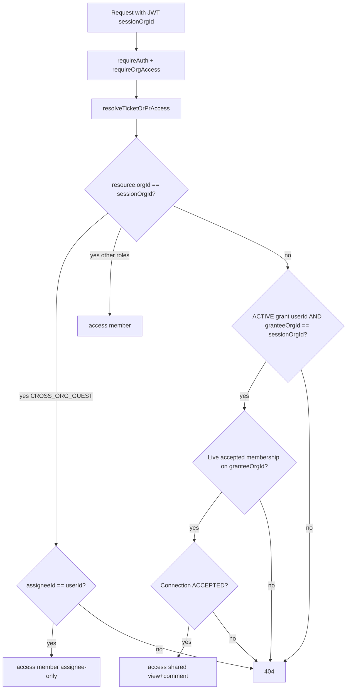

# Requirements — Cross-Org Collaboration (Tier 2)

Org connections, user-level ticket/PR share grants, home-org session share-path access (view + comment only), connection/share revocation with cascade, and a hard share-path BOLA test matrix. Partner users never receive owner-org membership.

Verified against:

- [assignment-spec.md](./assignment-spec.md) — cross-org access controls; item-level share; audit-logged share actions
- [tiered-build-plan.md](./tiered-build-plan.md) — org connections; ticket/PR share path; isolation tests
- [rbac-middleware.md](./rbac-middleware.md) — `requireAuth` → `requireOrgAccess` → role gates; platform admin override
- [database-schema.md](./database-schema.md) — `OrgConnection`; dual DB URLs; `unified_app` grants

---

## Locked Decisions

| # | Area | Choice |
|---|------|--------|
| 1 | Access model | **Home-org session + `ShareGrant`**. Partner never gets owner-org membership. |
| 2 | Share target | **User-level + `granteeOrgId`**. Body `{ recipientUserId, partnerOrgSlug }`. Cross-org only (`ownerOrgId !== granteeOrgId`). No org-wide broadcast. |
| 3 | Connection revoke | Soft-revoke cascade all ACTIVE grants between the pair; resolver requires grant ACTIVE + connection `ACCEPTED` + live membership. |
| 4 | Who acts | **Connections:** `ORG_ADMIN` self-service; **Platform Super Admin** force-revoke + list-all. **Shares:** owner mutators create; revoke by grantee user, grantee `ORG_ADMIN`, or owner mutator/`ORG_ADMIN`. |
| 5 | Share-path session | `sessionOrgId === grant.granteeOrgId` required. Wrong active org → **404**. |
| 6 | Shared capability | View + comment only regardless of home role. No mutate / upload / PR review / transition. |
| 7 | Eve / Frank | Eve → Globex `SUPPORT_AGENT` (receives Acme shares). Frank → Acme `CROSS_ORG_GUEST`; **assignee-only** visibility (no same-org `ShareGrant`). |
| 8 | Child `orgId` | `TicketComment` / `PrComment` / attachments always use **resource owner orgId**. Optional `authorOrgId` on `PrComment` for display. |
| 9 | Read middleware | Share-capable resource reads (ticket/PR GET, versions/diff, comments list/create, attachment list/meta/download) use `requireAuth` + `requireOrgAccessForResource` + resolver. Do **not** widen `PR_READER_ROLES` to add `SUPPORT_AGENT` for in-org PR listing. Own-org PR list stays `PR_MUTATOR_ROLES`. |
| 10 | Feature flags | Owner `commentsEnabled` blocks shared **comments**. Owner `attachmentsEnabled` blocks shared **uploads** only; list/meta/download remain allowed when access resolves. |
| 11 | Connection re-request | Canonical `orgAId < orgBId`; `REJECTED`/`REVOKED` → update in place to `PENDING`. |
| 12 | Same-org share | **Forbidden** — `400 same_org_share_not_supported`. `orgConnectionId` is **NOT NULL** always. |

### Hostile-review overrides (binding)

| Rule | Detail |
|------|--------|
| Strict mutators | Keep `getOrgTicketOrThrow` / `getOrgPrOrThrow` / `getOrgCommentOrThrow` / `getOrgAttachmentOrThrow` **single-org-strict** — mutations only. Guests/share recipients never enter mutation handlers. |
| Share reads | New `resolveTicketAccess` / `resolvePrAccess` for read / comment create / attachment download only. |
| Live re-check | Membership + connection + grant status on **every** shared read/comment — no cross-request cache. |
| Attachment download | Resolve ticket via `resolveTicketAccess`, then read `attachment.storageKey` **verbatim** (owner-keyed). Never rebuild key from session org. |
| Partial unique | `WHERE status = 'ACTIVE'` on `(resourceType, resourceId, grantedToUserId)`. REVOKED rows retained and do not block re-share. |
| DB CHECK | `owner_org_id <> grantee_org_id AND org_connection_id IS NOT NULL`. |

---

## Access Model



### Two-lane rule

| Lane | Functions | Tenancy |
|------|-----------|---------|
| **Mutations** | `getOrgTicketOrThrow` / `getOrgPrOrThrow` / … | `where: { id, orgId: sessionOrgId }` only → share recipients always **404** |
| **Reads / comments / downloads** | `resolveTicketAccess` / `resolvePrAccess` | Member path or share path (see diagram) |

### Resolve rules

1. Never `findFirst({ id })` alone without grant proof.
2. **Member path:** `resource.orgId === sessionOrgId`. If `CROSS_ORG_GUEST` → only when `assigneeId === userId`. Other roles: full org resource.
3. **Share path:** ACTIVE grant for `(grantedToUserId, granteeOrgId === sessionOrgId)`; `ownerOrgId === resource.orgId`; live accepted membership on `granteeOrgId`; connection `ACCEPTED`.
4. Fail → **404** (not 403) for missing/denied resources.
5. Child rows: after resolve, Prisma filters/creates use **`resource.orgId`** (owner). Feature flags: owner org.
6. Cross-org share is **item-level via `ShareGrant`** — not `CROSS_ORG_GUEST` membership in the owner org.

### Capability matrix

| Action | Owner-org mutator | Share recipient | In-org `CROSS_ORG_GUEST` |
|--------|-------------------|-----------------|--------------------------|
| GET assigned/own ticket | yes | shared item only | assignee only |
| GET shared ticket/PR | n/a | yes | n/a (no same-org share) |
| Comment create | yes | yes | on assigned ticket |
| Mutate / upload / review / transition | yes | **404 via strict getOrg\*** | **403** |
| Org settings | role gate | no elevation | **403** (removed from readers) |

### Lists

| List | Scope |
|------|--------|
| Non-guest ticket list | Own-org tickets ∪ inbound ACTIVE grants for `(userId, sessionOrgId)` |
| `CROSS_ORG_GUEST` ticket list | `assigneeId = userId` within session org only |
| PR own-org list | Unchanged — `PR_MUTATOR_ROLES` |
| Shared inbox | `GET /shared/tickets` / `GET /shared/prs` — ACTIVE grants for me + session as `granteeOrgId` |
| `GET /tickets/:id`, `GET /prs/:id` | `requireAuth` + `requireOrgAccess` (any role) + resolve |

---

## Schema

### `ShareGrant` (`share_grants`)

| Field | Notes |
|-------|--------|
| `resourceType` | `TICKET` \| `PULL_REQUEST` |
| `resourceId` | Shared ticket or PR id |
| `ownerOrgId` | Resource owner org |
| `granteeOrgId` | Recipient’s home org — must differ from `ownerOrgId` |
| `grantedToUserId` / `grantedByUserId` | User-level grant |
| `orgConnectionId` | **NOT NULL** — ACCEPTED connection at create |
| `status` | `ACTIVE` \| `REVOKED` |
| `revokeReason` | `"manual"` \| `"connection_revoked"` |

**Migration extras:**

- `GRANT SELECT, INSERT, UPDATE, DELETE ON share_grants, pr_comments TO unified_app`
- Partial unique: `CREATE UNIQUE INDEX … ON share_grants (resource_type, resource_id, granted_to_user_id) WHERE status = 'ACTIVE'`
- CHECK: `owner_org_id <> grantee_org_id AND org_connection_id IS NOT NULL`
- Re-share: if ACTIVE exists → **409**; else insert new ACTIVE (prior REVOKED rows retained)

### `PrComment` (`pr_comments`)

| Field | Notes |
|-------|--------|
| `orgId` | **Always** `pullRequest.orgId` (owner) — never author home org |
| `authorOrgId` | Optional — author’s session org for display |
| `authorId` / `body` | Author + comment text |

---

## API Surface

**Never accept raw org ids from the client for tenancy** — only slugs / `recipientUserId`. Active org comes from JWT/`req.orgId` only.

### Connections — `/connections`

Org routes: `requireAuth` → `requireOrgAccess` → `requireRole(ORG_ADMIN)`.

| Method | Path | Behavior |
|--------|------|----------|
| GET | `/connections` | Session org’s connections; `partnerOrg`, `direction` |
| POST | `/connections` | `{ partnerOrgSlug }`; canonicalize ids; 409 if PENDING/ACCEPTED; REJECTED/REVOKED → reset PENDING |
| POST | `/connections/:id/accept` \| `reject` | Non-requesting org admin only |
| POST | `/connections/:id/revoke` | Either side; cascade soft-revoke grants |
| GET | `/connections/:id/recipients?query=` | ACCEPTED; mutator/admin of a side; `{ userId, name, initials }` **no email**; paginated; audit-logged |
| GET | `/platform/connections` | `requirePlatformAdmin` list-all |
| POST | `/platform/connections/:id/force-revoke` | `requirePlatformAdmin` + cascade |

### Shares

| Method | Path | Notes |
|--------|------|-------|
| POST | `/tickets/:ticketId/shares` | Mutators; body `{ recipientUserId, partnerOrgSlug }`; ticket in session org; recipient accepted member of partner; ACCEPTED connection; reject if recipient already non-guest member of owner org; reject same-org |
| GET | `/tickets/:ticketId/shares` | Owner mutators — outbound for this ticket |
| POST/GET | `/prs/:prId/shares` | Mirror with `PR_MUTATOR_ROLES` |
| GET | `/shares/outbound` | Grants where `ownerOrgId = sessionOrgId` |
| GET | `/shares/inbound` | Grants where `granteeOrgId = sessionOrgId` (admin) or `grantedToUserId = me` |
| DELETE | `/shares/:shareId` | Grantee user, grantee `ORG_ADMIN`, or owner mutator/`ORG_ADMIN`; audit `revokedBy: owner\|grantee` |
| GET | `/shared/tickets` \| `/shared/prs` | ACTIVE grants for me + session as `granteeOrgId` |

### Middleware stacks

| Class | Stack |
|-------|-------|
| Ticket/PR GET by id, comments GET/POST, attachment download, `/shared/*` | `requireAuth` → `requireOrgAccess` → resolve in handler |
| Ticket/PR list own-org, mutates, attachment upload/delete, reviews/transition | Existing role gates + **strict** `getOrg*OrThrow` |

### Types / audit

- DTOs: `ConnectionDto`, `ShareGrantDto`, `access: "member" | "shared"`, optional `sharedFromOrg`
- Do **not** add `SUPPORT_AGENT` to in-org PR readers for listing all org PRs
- `AuditAction`: `connection.request|accept|reject|revoke`, `share.create|share.revoke`, platform force-revoke
- Remove `CROSS_ORG_GUEST` from `ORG_SETTINGS_READER_ROLES`

---

## Seed

| Change | Detail |
|--------|--------|
| Eve | Globex `SUPPORT_AGENT` only; Acme membership removed |
| Frank | `frank@example.com`, Acme `CROSS_ORG_GUEST`, **assignee** on one Acme ticket (no `ShareGrant`) |
| Shares | Alice → Eve on “Billing discrepancy” (`granteeOrgId=Globex`); Carol → Dave on one Globex PR (`granteeOrgId=Acme`) — Dave must use `activeOrg=Acme` to see it |
| Controls | Unshared siblings for BOLA |
| Connection | Acme ↔ Globex `ACCEPTED` |

Demo password remains `password123` for `*@example.com` / seeded org emails.

---

## Acceptance Criteria

1. Reads/comments/downloads go through `resolveTicketAccess` / `resolvePrAccess`; mutations keep strict `getOrg*OrThrow(sessionOrgId)`.
2. Share path requires `granteeOrgId === sessionOrgId`, live membership, ACTIVE grant, ACCEPTED connection — wrong active org → **404**.
3. `orgConnectionId` never null; same-org share → `400 same_org_share_not_supported`.
4. Child rows (`TicketComment`, `PrComment`, attachments) tenancy = owner org; Eve-authored comments still use owner `orgId`.
5. Shared access never elevates above view + comment; every mutation route returns 404/403 for share-only holders.
6. Connection revoke / platform force-revoke soft-revokes ACTIVE grants between the pair (`revokeReason: connection_revoked`).
7. Partial unique allows re-share after revoke (one ACTIVE; prior REVOKED retained).
8. `CROSS_ORG_GUEST` (Frank) lists/sees assignee-only tickets; no same-org `ShareGrant`.
9. Recipients picker returns `{ userId, name, initials }` with **no email**; non-mutator → 403.
10. Owner `commentsEnabled` blocks shared comments; owner `attachmentsEnabled` blocks shared **uploads** only (list/meta/download still allowed when access resolves). See [product-bola-gate.md](./product-bola-gate.md).
11. BOLA matrix covered by automated tests (Dave session scoping, live membership drop, unshared siblings, product attack matrix via `pnpm test:bola`). See [bola-tests.md](./bola-tests.md).
12. `pnpm typecheck` and `pnpm lint` pass.

### Verification commands

```bash
# After migrate + seed (share_grants / pr_comments must exist)
pnpm --filter @unified/db db:migrate
pnpm --filter @unified/db db:seed

# Integration (share BOLA + guest assignee-only)
pnpm --filter @unified/api test:integration

# Newman — API on :4000 with seeded DB
pnpm test:auth
```

### BOLA / hostile must-haves (tests)

Covered by integration suites under `apps/api/tests/integration/`:

| # | Assertion | Primary suite |
|---|-----------|---------------|
| 1 | Dave grant wrong `activeOrg` → **404** | `ticket-share-bola-matrix`, `item-shares-prs` |
| 2 | Comment `orgId` = owner org (incl. Eve-authored) | `ticket-share-bola-matrix`, `pr-comments` |
| 3 | Eve reads exactly shared PR; 404 siblings; no PR list widening | `item-shares-prs` |
| 4 | Revoke → re-share → one ACTIVE + prior REVOKED | `item-shares-tickets` |
| 5 | Same-org share → 400; `orgConnectionId` NOT NULL (API + DB CHECK) | `item-shares-tickets` |
| 6 | Remove grantee membership → next access 404 | `ticket-share-bola-matrix` |
| 7 | Owner `commentsEnabled=false` blocks shared comment; `attachmentsEnabled=false` blocks shared **upload** only (download still OK) | `ticket-share-bola-matrix`, `pr-comments`, `product-bola/nested-id-confusion` |
| 8 | Shared attachment download OK; unshared sibling 404 | `ticket-share-bola-matrix` |
| 9 | REJECTED → re-request → one canonical connection row | `org-connections` |
| 10 | Recipients picker: non-mutator 403; no email | `org-connections` |
| 11 | SUPPORT_AGENT cannot manage connections; wrong-org admin cannot accept/revoke | `org-connections` |
| 12 | Inbound/outbound lists; grantee user + grantee admin can revoke | `item-shares-tickets` |
| 13 | Mutation routes 404/403 for share-only holder | `ticket-share-bola-matrix` |
| 14 | Guest (Frank) list = assignee only; unassigned 404 | `ticket-share-bola-matrix`, guest updates in tickets/comments/attachments |

Fixtures: `apps/api/tests/support/share-fixtures.ts` (cleanup deletes `share_grants`). Newman: shared vs unshared vars + Frank assignee-only in `postman/unified-org-identity-auth.postman_collection.json`.

---

## Out of Scope

- Full platform admin **console UI** (API force-revoke / list-all only)
- Org-wide broadcast shares
- Same-org `ShareGrant` / in-org guest via grants
- Share → PR reviewer elevation
- Playwright share e2e
- Redis / notification fanout

AI digest leak coverage lives in `apps/api/tests/integration/ai-digest-leak.test.ts` (BOLA allowlist).
---

## Invariant

> Reads/comments/downloads go through `resolveTicketAccess` / `resolvePrAccess`. Mutations keep strict `getOrg*OrThrow(sessionOrgId)`. `sessionOrgId` is JWT-only. Share path requires `granteeOrgId === sessionOrgId`, live membership, ACTIVE grant, ACCEPTED connection. `orgConnectionId` never null; no same-org shares. Child rows tenancy = owner org. Shared access never elevates above view+comment.
